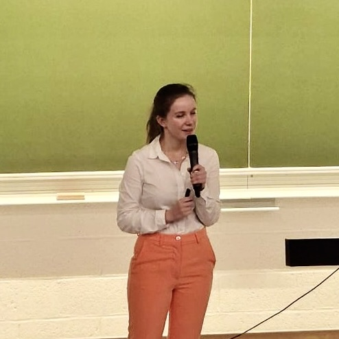

 

{{site.author.bio.full}}

<!-- My most recent project is SSH3, a revisit of the SSH protocol using HTTP/3 and QUIC,
[available on Github](https://github.com/francoismichel/ssh3) and
[presented at IETF 119](https://www.youtube.com/watch?v=bPNRO2HYITg), with an associated
[Internet Draft](https://www.ietf.org/archive/id/draft-michel-ssh3-00.html). It may already give you
a good overview of what I am capable of doing and the technologies I am used to play with. -->

If you want to know who I am as a researcher, check out my list of [highlighted publications](/publications/) and
[my scholar profile](https://scholar.google.com/citations?user=tl3X3AgAAAAJ&hl=en) !